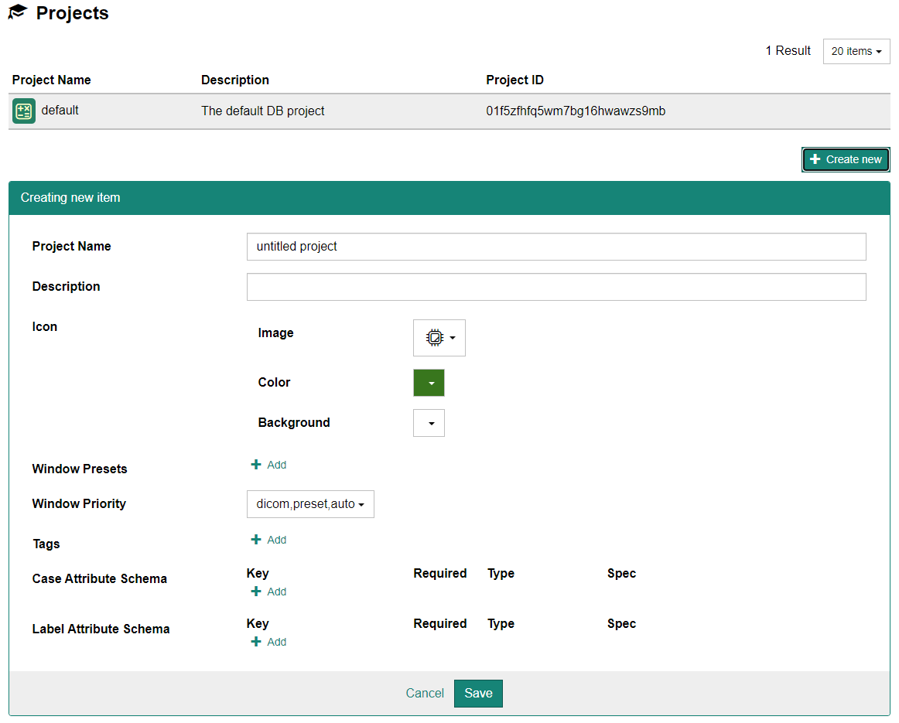
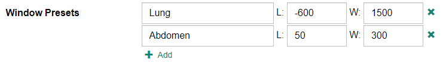
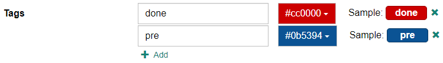
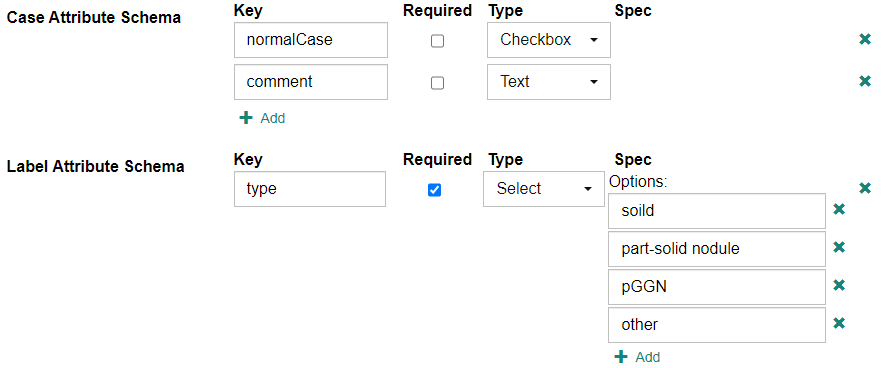

## Creating and Modifying Projects

Select [Administration] - [Projects] from the menu at the top of the screen to display the user settings screen.

To create a new project, click the "Create new" button. After entering each item, click "Save".

To make changes to an existing project, click on the line of the project whose settings you wish to change from the top list.

## Configurable Options

<ParamList>

- 'Project Name': The name of the project. This can be changed later. For example, "XYZ Study 2020".

- 'Description': The longer description of this project.

- 'Icon': The icon of this project. You can choose the image, the foreground color and the background color.

- 'Window Presets': The list of presets of DICOM windows (a pair of window level and window width).
    

- 'Window Priority': Determines how to set the initial window level/width when displaying DICOM series on CIRCUS DB.
    - `preset`: Uses the first entry of "Window Presets" (described above). If there is no preset, falls back to the next option.
    - `dicom`: Uses the window value in the DICOM series (window center (0x0028, 0x0050) / window width (0x0028, 0x0051). If these DICOM tags are not present, falls back to the next option.
    - `auto`: Automatically adjests the window based on the minimum/maximum pixel values of the DICOM series.

- 'Tags': The list of available tags a user can associate to each case.
    

- 'Case/Label Attribute Schema': The list of attributes (additional information) a user can enter for each case or label. Those data will be stored key/value pairs.
    - `Key`: The key to store this data with.
    - `Required`: Determines if this data is required.
    - `Type`: The data type of this attribute.
        - `Text`: The data is stored as a string.
        - `Number`: The data is stored as a number.
        - `Integer`: The data is stored as an integer.
        - `Checkbox`: The data is stored as a boolean (true/false value).
        - `Select`: The data will be one of the items specified in the Spec section.
    - `Spec`: Additional constrains for each type. When the type is 'Select', you can specify the list of items.
    

</ParamList>
