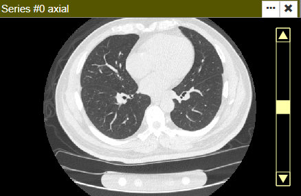
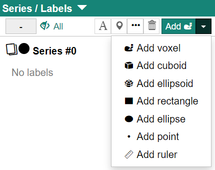
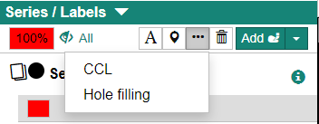

Case Search の検索結果のリスト各行にある[View]ボタンをクリックすると、Case Detail 画面が表示されます。Case Detail 画面ではラベルおよび属性情報の入力を行います。

## Case Detail 画面の構成

Case Detail 画面は以下の要素で構成されています。

### Case Info

Case ID、患者情報（患者情報表示権限を有する場合）、プロジェクト名、タグが表示されます。

### Revision

現在表示しているリビジョンの情報が表示されています。プルダウンメニューになっているので表示するリビジョンを切り替えることも可能です。

### DICOM Viewer Component

DICOM シリーズより生成したボリュームデータが表示されます。初期状態では axial 断面のほかに MPR(coronal, sagittal, oblique)の 4 断面が表示されます。

### Series / Labels

ケースに属しているシリーズ、ならびに各シリーズに属しているラベルの情報が表示されるとともに、ラベルの属性情報の入力インターフェイスがあります。

### Case Attributes

ケースの属性情報の入力インターフェイスがあります。

## DICOM Viewer Component

### 左ドラッグ時の操作について

### 画像のスクロール

DICOM Viewer Componentの画像は以下の方法でスクロールすることができます。

- マウス左ドラッグ操作を Pager に設定(Pager アイコンをクリック、もしくは"P"キーを押す)した上で、スクロールしたい断面で左ドラッグをします。

- スクロールしたい断面でマウスカーソルを合わせて、マウスホイールでスクロールします。

  :::note

  現状ではマウスホイールの動きと画像のページングが逆になっています（マウスホイールを下に動かすと画像が上方向にページングされます）。

  :::

- 設定ツールバーの[Scroll bars] で [Small] もしくは [Large]を選択し（左下図）、スクロールしたい断面の右端にマウスカーソルを合わせるとスクロールバーが表示されます（右下図）。

  |  |  |
  | :-----------------------------------------------------: | :-----------------------------------------------------: |
  |                  スクロールバーの設定                   |                  スクロールバーの表示                   |

### 画面表示の切替

初期状態は axial 断面、coronal 断面、sagittal 断面、oblique 断面が 2 行 ×2 列で表示されていますが、ツールバーにて axial、coronal、sagittal のみの表示に切り替えることができます。

## ラベルの新規入力

"Series/Labels" の[Add ●]の右側のプルダウンメニューよりラベルの種類を選択します。

CIRCUS DB で実装しているラベルは以下の通りです。

### voxel

ボクセル単位で塗りつぶすラベルです。

### ROI (2D/3D)

CIRCUS DBでは2Dおよび3Dの関心領域(ROI)をラベルとすることもできます。初期状態ではラベル追加時の画像の中心に設置されます。

#### cuboid (3D)

直方体 ROI です。初期状態では立方体です。

#### ellipsoid (3D)

楕円体 ROI です。初期状態では正球です。

#### rectangle (2D)

長方形 ROI です。初期状態では正方形です。

#### ellipse (2D)

楕円 ROI です。初期状態では正円です。

:::tip

2D ROI は設定したスライスの上下 3 スライスでは半透明で表示されます。

:::

### point

点状のラベルです。初期状態ではラベル追加時の画像の中心に設置されます。

### ruler

サイズ計測用ラベルです。初期状態ではラベル追加時の画像の中心に設置されます。

## ボクセルラベルに

## ROI の移動・サイズ変更

### 移動

マウスカーソルを ROI の端に合わせると、マウスカーソルが十字矢印に変わります。マウスの左ボタンを押しながらドラッグすると ROI が移動します。

### サイズ変更

マウスカーソルを ROI の端にある &#9633; に合わせると、マウスカーソルが両矢印に変わります。マウスの左ボタンを押しながらドラッグをすることで ROI のサイズを変えられます。

- Shift キーを押しながらサイズを変えると各軸のアスペクト比が維持されます。
- Ctrl キーを押しながらサイズを変えると ROI の中心が固定された状態でサイズが変わります。

## Undo / Redo / Revert

- 画面右上[Save]ボタンの左側にある&#x25C0;、&#x25B6;ボタンで操作の undo、redo が行えます(undo は Ctrl キー+Z キーでも行えます）。
- 画面右上[Save]ボタンの右側にあるメニューボタンより[Revert]を選択すると、Revision の最初の状態まで戻すことができます。ただし、Revert した場合はこれまでの操作の記録が消去されます。

## エクスポート

ケースのデータ（元画像、voxel ラベルのボリュームデータ、属性情報）をダウンロードするためには、画面右上のメニューボタンから[Export as MHD]を選択します。以下のダイアログが表示されますので、条件を選択した上で、[Start download]ボタンをクリックします。

- Voxel labels
  - 現在はラベル毎に別々のボリュームで出力する(Isolated)か、全てのラベルを1つのボリュームで出力するかを選択します。
- MHD file line endings  
  - mhdファイルの改行コードをLF(Linux)、CR + LF(Windows)を選択します。
- Comression format
  - エクスポートデータの圧縮形式を選択します(tar.gz or ZIP)。

### 生成されるデータ

#### vol[シリーズ番号].mhd (+.raw)

シリーズの元画像のボリュームデータです。

#### vol[シリーズ番号]\_label[ラベル番号].mhd (+.raw)

voxel ラベルデータです。

#### data.json

症例の属性情報(JSON 形式)です。

:::tip

ROI、point、rulerの情報はdata.jsonに含まれます。位置はボリュームの左上ボクセルを原点としたmm単位で書かれています。

:::

## Connected component analysis

"Series/Labels" の[…]より、アクティブな voxel ラベルに対して Connected component labeling(CCL)、Hole filling を行うことができます。

### Connected component labeling(CCL)

アクティブな voxel ラベルを 3 次元で連結する voxel ごとに別のラベルに分割します。

| 設定オプション           | 範囲    | 詳細                                                                                                      |
| ------------------------ | ------- | --------------------------------------------------------------------------------------------------------- |
| 表示する最大連結要素数 N | 1 ～ 10 | 体積が大きい順に N 個の voxel ラベルを新たに作成し、それ以外の領域は一つの voxel ラベルにまとめて表示する |
| 近傍数                   | 6、26   | 連結判定に使用                                                                                            |

## Hole filling

アクティブな voxel ラベルの穴埋めをします。

| 設定オプション | 範囲                    | 詳細               |
| -------------- | ----------------------- | ------------------ |
| 次元数         | 2、3                    |                    |
| Orientation    | Axial、Sagital、Colonal | 2 次元の時のみ選択 |
| 近傍数         | 6、26                   | 連結判定に使用     |

:::caution
CCL・Hole filling は計算途中で voxel ラベルの分割数が 255 を超える複雑な形状には対応していません。
:::
