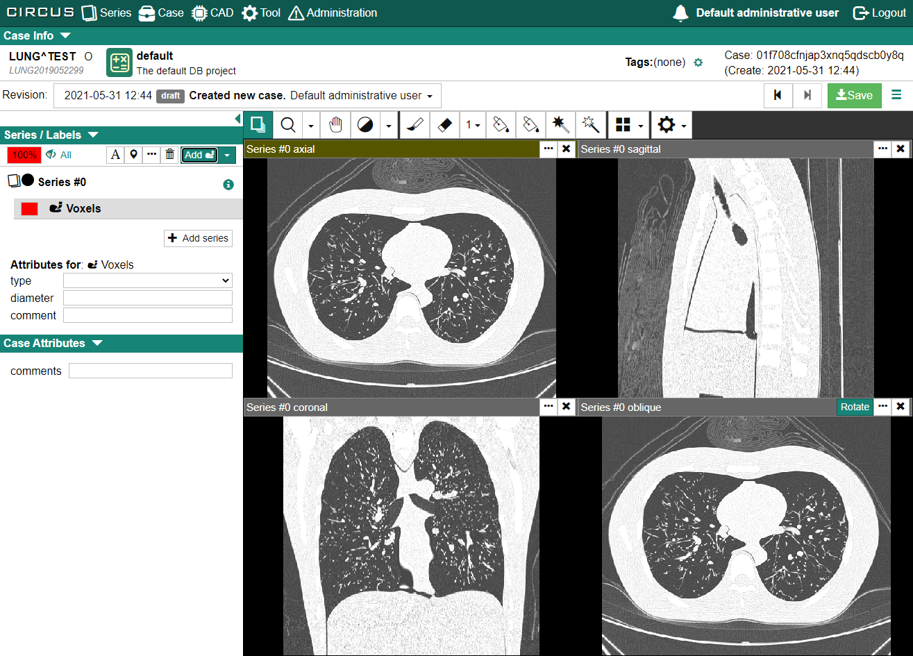
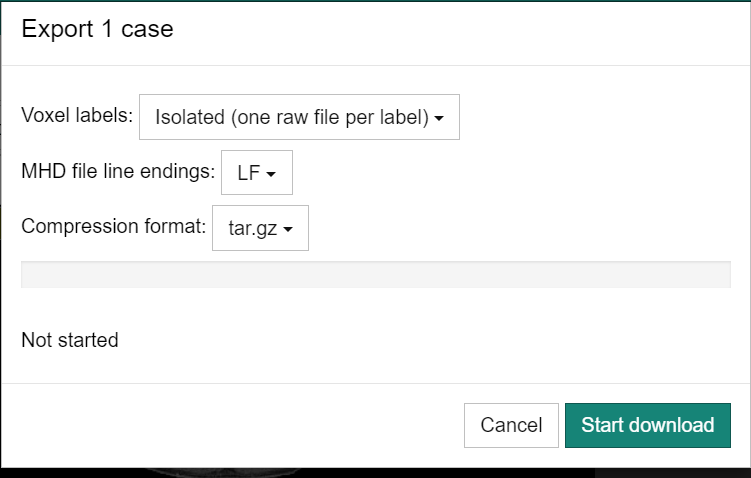

Case Search の検索結果のリスト各行にある [View] ボタンをクリックすると、Case Detail 画面が表示されます。Case Detail 画面ではラベルおよび属性情報の入力を行います。

## Case Detail 画面の構成

Case Detail 画面は以下の要素で構成されています。

Case Info
: Case ID、患者情報（患者情報表示権限を有する場合）、プロジェクト名、タグが表示されます。

Revision
: 現在表示しているリビジョンの情報が表示されています。プルダウンメニューになっているので表示するリビジョンを切り替えることも可能です。

DICOM ビューア
: DICOM シリーズより生成したボリュームデータが表示されます。初期状態では axial 断面のほかに MPR(coronal, sagittal, oblique)の 4 断面が表示されます。

Series / Labels
: ケースに属しているシリーズ、ならびに各シリーズに属しているラベルの情報が表示されるとともに、ラベルの属性情報の入力インターフェイスがあります。

Case Attributes
: ケースの属性情報の入力インターフェイスがあります。

## DICOM Viewer Component の操作

### 左ドラッグ時の操作

DICOM Viewer Component 左上のツールバーで、マウスの左ドラッグ時の操作を選択できます。下図のアイコンは左側より以下の通りです。

import { Icon } from '../icon';

<dl>
<dt><Icon icon="rs-icon-pager" /> Paging (<kbd>P</kbd>)</dt>
<dd>画像のスクロール（ページング）を行います。</dd>
<dt><Icon icon="rs-icon-zoom" /> Zoom (<kbd>Z</kbd>)</dt>
<dd>画像のズームを行います。アイコン右側のプルダウンメニューにより、現在の表示画像を一定の倍率でズームすることもできます (×8, ×4, ×2, ×1/2, ×1/4, ×1/8)。</dd>
<dt><Icon icon="rs-icon-hand" />Hand (<kbd>H</kbd>)</dt>
<dd>画像の表示位置を移動させることができます。</dd>
<dt><Icon icon="rs-icon-window" /> Window (<kbd>W</kbd>)</dt>
<dd>画像の表示条件 (Window Level, Window Width) を変えることができます。アイコン右側のプルダウンメニューで登録済のプリセット値への変更や、マニュアルでの設定が行えます。</dd>
</dl>

カッコ内はキーボードショートカットです（以下同様）。

### 画像のスクロール

DICOM Viewer Component の画像は以下の方法でスクロールすることができます。

- マウス左ドラッグ操作を Pager <Icon icon="rs-icon-pager" /> に設定（Pager アイコンをクリック、もしくは <kbd>P</kbd> キーを押す）した上で、スクロールしたい断面で左ドラッグをします。

- スクロールしたい断面でマウスカーソルを合わせて、マウスホイールでスクロールします。

- 設定ツールバーの [Scroll bars] で [Small] もしくは [Large] を選択し（左下図）、スクロールしたい断面の右端にマウスカーソルを合わせるとスクロールバーが表示されます（右下図）。

  |  |  |
  | :-----------------------------------------------------: | :-----------------------------------------------------: |
  |                  スクロールバーの設定                   |                  スクロールバーの表示                   |

### 画面表示の切替

初期状態は axial 断面、coronal 断面、sagittal 断面、oblique 断面が 2 行 ×2 列で表示されていますが、ツールバーにて axial、coronal、sagittal のみの表示に切り替えることができます。

### リファレンス線、補間

DICOM Viewer Component 上部の歯車アイコンより "Show reference line" を選択するとリファレンス線を表示されます。

Triliear filtering を選択すると表示画像に対して線形補間が行われます（選択しない場合は nearest neighbor 法による補間）。表示は滑らかになりますが、表示速度は遅くなります。

## ラベルの新規入力

"Series/Labels" の [Add ●] の右側のプルダウンメニューよりラベルの種類を選択します。

CIRCUS DB で実装しているラベルは以下の通りです。

<dl>
<dt><Icon icon="circus-icon-annotation-voxel"/> voxel</dt>
<dd>ボクセル単位で塗りつぶすラベルです。</dd>
<dt><Icon icon="circus-icon-annotation-cuboid"/> cuboid (3D)</dt>
<dd>直方体 ROI です。作成直後は立方体です。</dd>
<dt><Icon icon="circus-icon-annotation-ellipsoid"/> ellipsoid (3D)</dt>
<dd>楕円体 ROI です。作成直後は正球です。</dd>
<dt><Icon icon="circus-icon-annotation-rectangle"/> rectangle (2D)</dt>
<dd>長方形 ROI です。作成直後は正方形です。</dd>
<dt><Icon icon="circus-icon-annotation-ellipse"/> ellipse (2D)</dt>
<dd>楕円 ROI です。作成直後は正円です。</dd>
<dt><Icon icon="circus-icon-annotation-point"/> point</dt>
<dd>点状のラベルです。作成直後はラベル追加時の画像の中心に設置されます。</dd>
<dt><Icon icon="circus-icon-annotation-ruler"/> ruler</dt>
<dd>サイズ計測用ラベルです。作成直後はラベル追加時の画像の中心に設置されます。</dd>
</dl>

2D ROI は設定したスライスの上下 3 スライスでは半透明で表示されます。

## ボクセルラベルに対する操作

DICOM Viewer Component 上部のツールバーで、ボクセルラベルに対する操作を選択します。下図のアイコンは左側より以下の通りです。

<dl>
<dt><Icon icon="rs-icon-brush" /> ブラシ (<kbd>B</kbd>)</dt>
<dd>クリックした位置を四角いペンで塗ります。</dd>
<dt><Icon icon="rs-icon-eraser" /> 消しゴム (<kbd>E</kbd>)</dt>
<dd>クリックした位置のラベルを消去します。</dd>
<dt>ブラシ・消しゴムの太さ設定</dt>
<dd>プルダウンメニューでブラシ・消しゴムの太さを設定します。</dd>
<dt><Icon icon="rs-icon-bucket" /> バケツツール (<kbd>Shift</kbd>+<kbd>B</kbd>)</dt>
<dd>クリックした位置から連結している同じラベル値の領域を塗りつぶします。</dd>
<dt><Icon icon="rs-icon-bucket-erase" /> バケツ消去ツール (<kbd>Shift</kbd>+<kbd>E</kbd>)</dt>
<dd>クリックした位置から連結している同じラベル値の領域を消去します。</dd>
<dt><Icon icon="rs-icon-wand" /> ワンドツール (<kbd>M</kbd>)</dt>
<dd>背景画像の画素値に対し、クリックした位置の画素値から一定範囲の画素値を持つ画素を塗ります。スレッショルドと最大距離をオプションで設定できます。</dd>
<dt><Icon icon="rs-icon-wand-eraser" /> ワンド消去ツール (<kbd>Shift</kbd>+<kbd>M</kbd>)</dt>
<dd>背景画像の画素値に対し、クリックした位置の画素値から一定範囲の画素値を持つ画素を消去します。</dd>
</dl>

:::note

全ボリュームデータの読込が完了するまでの間（ローディングインジゲータが表示されている間）は、ワンドツールおよびワンド消去ツールは有効になりません。

:::

### Connected Component Analysis

"Series/Labels" の […] より、アクティブな voxel ラベルに対して Connected component labeling (CCL)、Hole filling を行うことができます。

#### Connected Component Labeling (CCL)

アクティブな voxel ラベルを 3 次元で連結する voxel ごとに別のラベルに分割します。

最大連結要素数 N
: 体積が大きい順に N 個の voxel ラベルを新たに作成し、それ以外の領域はひとつの voxel ラベルにまとめて表示する

近傍数
: 連結判定モード（6 近傍または 26 近傍）

#### Hole Filling

アクティブな voxel ラベルの穴埋めをします。

次元数
: 2 または 3

Orientation
: Axial、Sagital、Colonal | 2 次元の時のみ選択 |

近傍数
: 連結判定モード（2 次元の場合は 4 または 8 近傍、3 次元の場合は 6 または 26 近傍）

:::note
CCL および Hole filling は計算途中で voxel ラベルの分割数が 255 を超える複雑な形状には対応していません。
:::

## ROI の移動・サイズ変更

### 移動

マウスカーソルを ROI の端に合わせると、マウスカーソルが十字矢印に変わります。マウスの左ボタンを押しながらドラッグすると ROI が移動します。

### サイズ変更

マウスカーソルを ROI の端にある &#9633; に合わせると、マウスカーソルが両矢印に変わります。マウスの左ボタンを押しながらドラッグをすることで ROI のサイズを変えられます。

- <kbd>Shift</kbd> キーを押しながらサイズを変えると各軸のアスペクト比が維持されます。
- <kbd>Ctrl</kbd> キーを押しながらサイズを変えると ROI の中心が固定された状態でサイズが変わります。

## Undo / Redo / Revert

- 画面右上 [Save] ボタンの左側にある &#x25C0;、&#x25B6; ボタンで操作の undo、redo が行えます(undo は Ctrl キー+Z キーでも行えます）。
- 画面右上 [Save] ボタンの右側にあるメニューボタンより [Revert] を選択すると、Revision の最初の状態まで戻すことができます。ただし、Revert した場合はこれまでの操作の記録が消去されます。

## エクスポート

ケースのデータ（元画像、voxel ラベルのボリュームデータ、属性情報）をダウンロードするためには、画面右上のメニューボタンから [Export as MHD] を選択します。以下のダイアログが表示されますので、条件を選択した上で、[Start download] ボタンをクリックします。

Voxel labels
: 現在はラベル毎に別々のボリュームで出力する (Isolated) か、全てのラベルを 1 つのボリュームで出力するかを選択します。

MHD file line endings
: mhd ファイルの改行コードを LF (Linux)、CR + LF (Windows) を選択します。

Comression format
: エクスポートデータの圧縮形式を選択します(tar.gz or ZIP)。

### 生成されるデータ

vol[シリーズ番号].mhd (+.raw)
: シリーズの元画像のボリュームデータです。

vol[シリーズ番号]\_label[ラベル番号].mhd (+.raw)
: voxel ラベルデータです。

data.json
: 症例の属性情報 (JSON 形式) です。

:::note

ROI、point、ruler の情報は data.json に含まれます。位置はボリュームの左上ボクセルを原点とした mm 単位で書かれています。

:::
