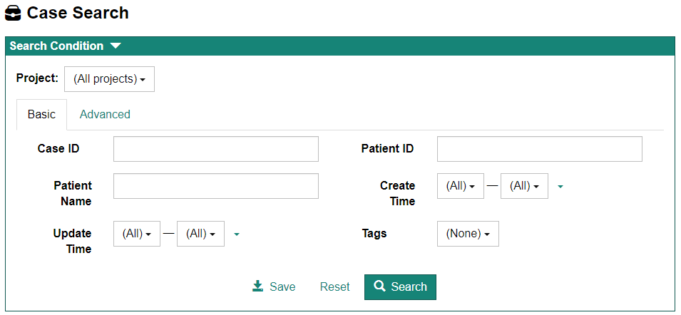

## Case Search 画面の表示方法

画面上部のメニューより [Case] - [Case Search] を選択すると Case Search 画面が表示されます。

:::tip

ホーム画面中央の [Case Search] ボタンをクリックしても表示されます。

:::

## 検索条件の設定

Case Search 画面の上部の "Search Condition" にて検索条件を設定します。検索条件の設定方法として、Basic および Advanced の 2 種類があります。それぞれはタブによって切り替えることが出来ます。

:::note

検索条件設定画面が表示されていない場合は "Search Condition" 上部の &#9660; をクリックします。

:::

### Basic

Basic では基本的な検索条件により検索ができます。

### Advanced

Advanced では検索条件をより詳細に設定することができます。Basic にはない検索項目 (age, sex) を用いた検索も行うことができます。

### 検索条件の保存

よく使用する検索条件をプリセットとして保存することができます。検索条件設定画面下部の [Save] ボタンをクリックすると、プリセット名を設定するダイアログが表示されますので、名前を設定して [OK] ボタンをクリックします。

保存したプリセットはメニューの [Case] より呼び出すことができます。

:::note

プリセットの削除方法は[ユーザ固有の設定](user-preference.md)を参照ください。

:::

## 検索結果のリスト表示

検索結果は画面下部に表示されます。

- リスト各行の "Case ID" 列にある虫眼鏡アイコンをクリックすると、Case ID が表示されます。Case ID をクリップボードにコピーすることもできます。

- リスト各行の [View] ボタンをクリックすると、Case Detail 画面が表示されます。
