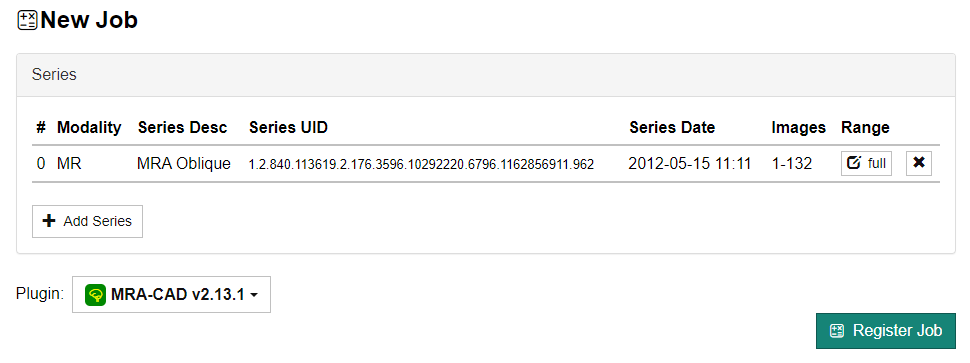
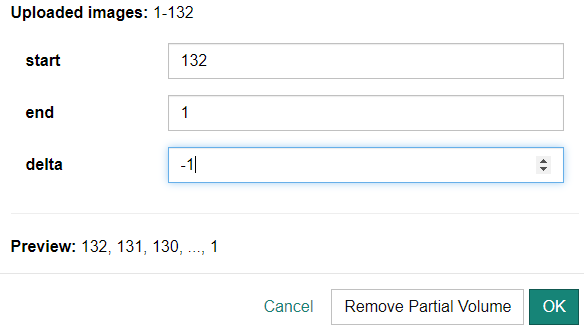
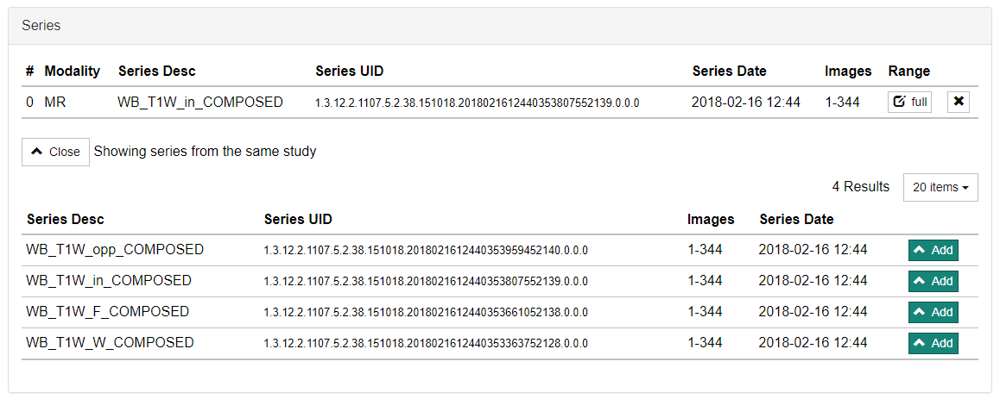

CIRCUS CSではCADソフトウェアなどのプラグインの実行指令は、「ジョブ」として登録され、登録時に「Job ID」が割り当てられます。ジョブは一度にひとつずつ逐次実行されます（1台のマシンで複数のジョブを同時実行することはできません）。

## ケースの登録手順

1. Series Search画面で処理を行いたいDICOMシリーズを検索し、そのシリーズのリスト右側の[+ New]より "New Case" を選択します。

   :::tip

    Caseに複数シリーズを登録する場合は、最初のシリーズに対して"New Case"（新規ケース登録）を行います。2番目以降のシリーズはNew Case画面で設定します。

   :::

1. New Case画面が表示されます。"Series" で処理対象のDICOMシリーズを設定します(後述)。所属するプロジェクトは下部の"Project"より選択します。設定が完了したら [Create case for XXXX] (XXXXは選択したプロジェクト名) ボタンをクリックします。ケースが登録されるとケース情報入力画面が表示されます。

    

## 登録DICOMシリーズの設定

- シリーズの一部のみを使用する、もしくは画像番号の順番を変える（上下反転させる）場合は、シリーズリストのRange列にあるボタン（初期状態は[full])をクリックします。すると、設定ダイアログが表示されますので、start(開始画像番号)、end(終了画像番号)、delta(差分、上下反転させる場合は負値)を設定し、[OK]ボタンをクリックします。

    

- 他のシリーズを追加したい場合はまず、[+ Add Series]ボタンをクリックします。すると、同一検査の他のシリーズが一覧で表示されますので、追加するシリーズ右側の [Add]ボタンをクリックしてください。

    

