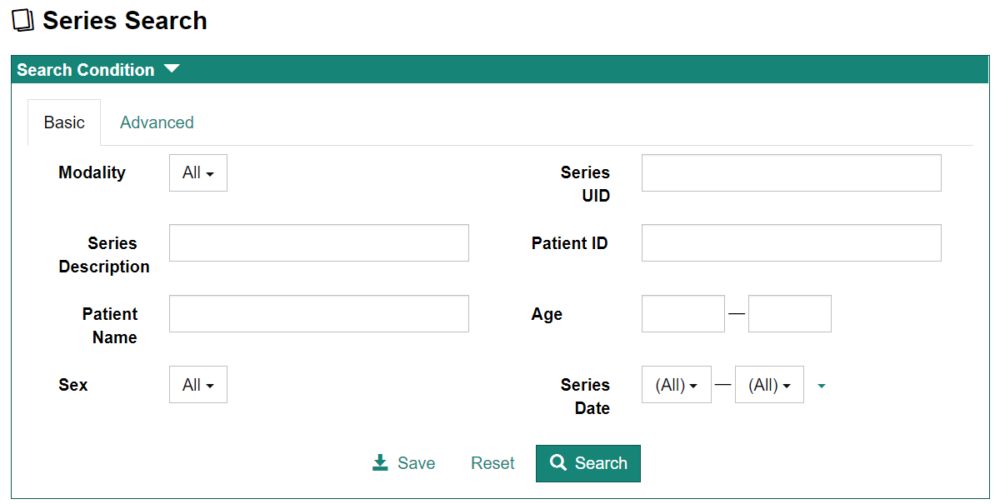
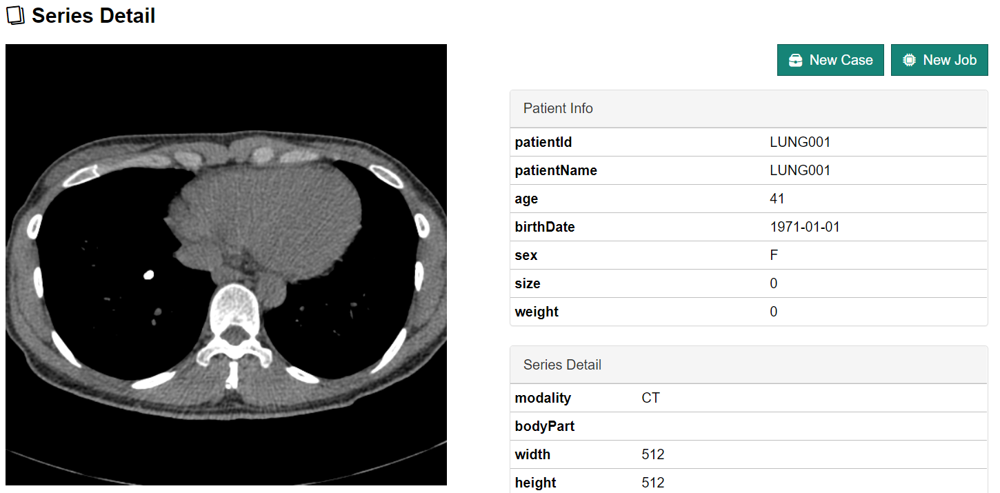

You can enter the Series Search screen in two ways:

- Select [Series] - [Series Search] in the top menu.
- Select [Series Search] in the home screen.

## Setting Search Conditions

You can specify the search condition in the "Search Condition" on the top of the page. You can toggle search modes using the tab.

:::note

If the condition box is collapsed, click the "Search Condition" bar to expand it.

:::

### Basic Search

You can perform search using basic conditions.

### Advanced Search

Advanced search lets you use other search keys and complex conditions.

### Saving Presets

You can save the condition you frequently use as a named preset. Perform the search with the condition you want to save, and then click the "Save" button.

You can access the saved preset in the top "Series" menu.

:::note

To delete presets, see [User Preference](user-preference.md).

:::

## Viewing Series Search Results

Search results will be displayed below the condition box.

- Click on the magnifying glass icon in the "UID" column of each row of the list to display the Study Instance UID and Series Instance UID for that series. You can copy each UID to the clipboard.

- Clicking the "View" button on each row of the list displays the Series Detail screen, which shows the images and detailed information about the series.

  

- Click [+ New] to [create a new Case](./new-case) (CIRCUS DB) or [create a new plug-in job](./new-job) (CIRCUS CS).
